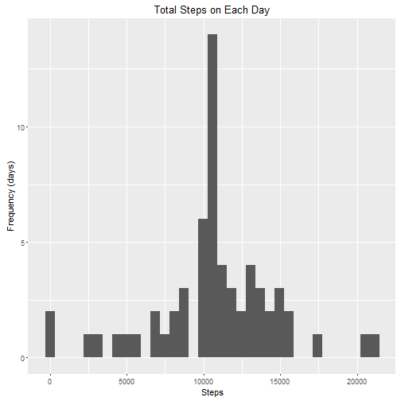

# Reproducible Research Project 1

This is an R Markdown file to report the answers and findings of the 1st assignment in Reproducible Research course by Johns Hopkins University. Each question is listed as a sub-heading in this document.

## Loading and preprocessing the data

In this report, we use ```ggplot2``` package to plot all the graphs.


```r
library(ggplot2)
library(dplyr)
```

To improve reproducibility, the environment parameters of analysis is written down here.


```r
sessionInfo()
```

```
## R version 3.3.1 (2016-06-21)
## Platform: x86_64-w64-mingw32/x64 (64-bit)
## Running under: Windows >= 8 x64 (build 9200)
## 
## locale:
## [1] LC_COLLATE=English_United Kingdom.1252 
## [2] LC_CTYPE=English_United Kingdom.1252   
## [3] LC_MONETARY=English_United Kingdom.1252
## [4] LC_NUMERIC=C                           
## [5] LC_TIME=English_United Kingdom.1252    
## 
## attached base packages:
## [1] stats     graphics  grDevices utils     datasets  methods   base     
## 
## other attached packages:
## [1] dplyr_0.5.0   ggplot2_2.1.0 knitr_1.14   
## 
## loaded via a namespace (and not attached):
##  [1] Rcpp_0.12.7      magrittr_1.5     munsell_0.4.3    colorspace_1.2-6
##  [5] R6_2.1.3         stringr_1.1.0    highr_0.6        plyr_1.8.4      
##  [9] tools_3.3.1      grid_3.3.1       gtable_0.2.0     DBI_0.5-1       
## [13] htmltools_0.3.5  yaml_2.1.13      lazyeval_0.2.0   assertthat_0.1  
## [17] digest_0.6.10    tibble_1.2       formatR_1.4      codetools_0.2-14
## [21] rsconnect_0.4.3  mime_0.5         evaluate_0.9     rmarkdown_1.1   
## [25] labeling_0.3     stringi_1.1.2    scales_0.4.0     markdown_0.7.7
```


To start our analysis, we download the data from the web and put it in R data frame ```activity```. Download time is noted in ```downloadTime```

```r
download.file("https://d396qusza40orc.cloudfront.net/repdata%2Fdata%2Factivity.zip","Factivity.zip")
downloadTime <- Sys.time() ##Record the time of download
unzip("Factivity.zip")
activity <- read.csv("activity.csv", stringsAsFactors = FALSE)
activity$date <- as.Date(activity$date)
names(activity) <- c("Steps","Date","Interval")
str(activity)
```

```
## 'data.frame':	17568 obs. of  3 variables:
##  $ Steps   : int  NA NA NA NA NA NA NA NA NA NA ...
##  $ Date    : Date, format: "2012-10-01" "2012-10-01" ...
##  $ Interval: int  0 5 10 15 20 25 30 35 40 45 ...
```


## What is mean total number of steps taken per day?
As part of the instructions, missing value in the dataset is just left as it is. The following histogram shows the total steps taken in any given day. Days with total 0 steps are those that consist of missing values. 
Ignore the warning that comes after the code.


```r
totalStepsEachDate <- aggregate(Steps~Date,data = activity,FUN = sum,na.rm=TRUE)
ggplot(data = activity, aes(Date, Steps)) +
        stat_summary(fun.y = sum, geom = "bar") +
        ggtitle("Total Steps on Each Day")
```

```
## Warning: Removed 2304 rows containing non-finite values (stat_summary).
```


```r
stepMean<-mean(totalStepsEachDate$Steps)
stepMedian<-median(totalStepsEachDate$Steps)
```

The mean of total steps on each day is 10766.19 steps.
The median of total steps on each day is 10765 steps.

## What is the average daily activity pattern?
Now, we look at the activity pattern that emerges by averaging the values in each interval.


```r
averageDailySteps<-aggregate(Steps~Interval, data = activity, FUN = mean, na.rm = TRUE)
ggplot(averageDailySteps, aes(Interval, Steps)) +
      geom_line() +
      ggtitle("Average Daily Activity Pattern")
```


```r
maxInterval<-averageDailySteps[which.max(averageDailySteps$Steps),]
```

The 5-minute interval containing the highest number of steps on average is the 835th which has 206 steps. 


## Imputing missing values

In our dataset, there are missing values in the `Steps` column. This section provides the method we use to impute the NAs.

```r
table(complete.cases(activity))[[1]]
```

```
## [1] 2304
```

```r
imputedSteps<-ifelse(is.na(activity$Steps),averageDailySteps[match(x = activity$Interval,table = averageDailySteps$Interval),2],activity$Steps)
activity2 <- data.frame(Steps=imputedSteps,Date=activity$Date,Interval=activity$Interval)
```

To be exact, there are 2304 NAs in the dataset. We substitute the missing `Steps` value in the `activity` data frame with the average `Steps` value from the average daily pattern (`averageDailySteps`), and the imputed data frame is stored in `activity2`.

After imputation, the following plot of total steps on each day is generated from the `activity2` data frame.


```r
totalStepsEachDate2 <- aggregate(Steps~Date,data = activity2,FUN = sum,na.rm=TRUE)
ggplot(data = activity2, aes(Date, Steps)) +
        stat_summary(fun.y = sum, geom = "bar") +
        ggtitle("Total Steps on Each Day with Imputation")
```



```r
stepMean2<-mean(totalStepsEachDate2$Steps)
stepMedian2<-median(totalStepsEachDate2$Steps)
```

Notice that there is no day with total 0 step (the minimum is 41).

The mean of total steps on each day is 10766.19 steps.
The median of total steps on each day is 10766.19 steps. Our method of imputation does not change the aforementioned statistics by much. However, the estimate of total daily number of steps on days with previously missing values are all the same i.e. 10766.19 steps.


## Are there differences in activity patterns between weekdays and weekends?

In the last part of our analysis, we like to see if there is any difference in activity on weekday and weekend. The following plot shows time-series graphs of the 5-minute interval (x-axis) and the average number of steps taken, averaged across all weekday days or weekend days (y-axis).


```r
dayType<-as.factor(ifelse(weekdays(activity$Date,abbreviate = TRUE)%in%c("Sat","Sun"),"Weekend","Weekday"))
activity2$Day.Type <- dayType
activity2 <- activity2 %>% group_by(Day.Type) %>% mutate(Mean=mean(Steps))

ggplot(data = activity2, aes(y = Steps, x = Interval)) +
    stat_summary(fun.y = mean, geom ="line") +
    facet_wrap(~Day.Type,nrow = 2) +
    geom_hline(aes(yintercept=Mean,group = Day.Type), colour='blue')
```


As you can see from the graphs, the highest number of steps happen during weekdays. The blue lines indicating the means tell us that weekend has higher average number of steps than weekdays.

