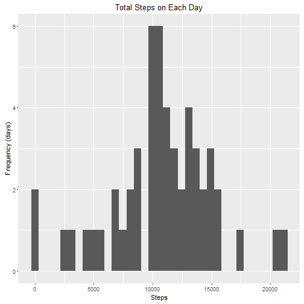
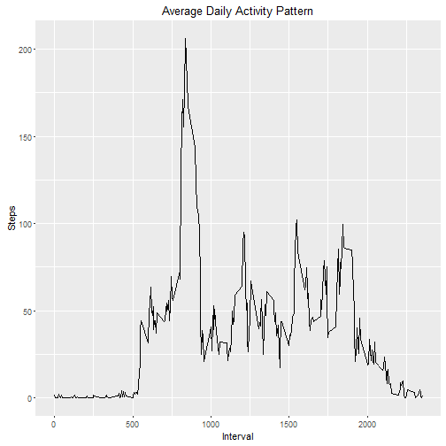
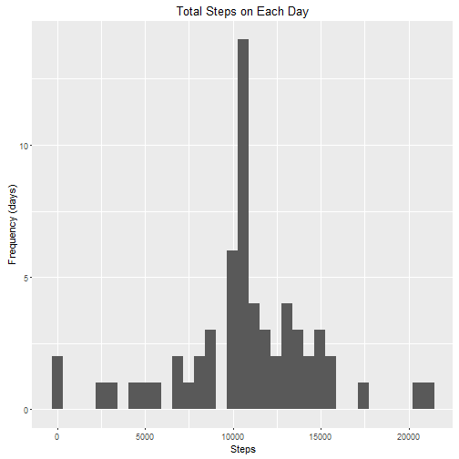
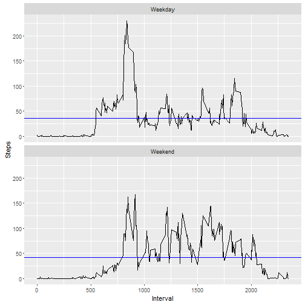

# Reproducible Research Project 1

## Introduction

It is now possible to collect a large amount of data about personal
movement using activity monitoring devices such as a
[Fitbit](http://www.fitbit.com), [Nike
Fuelband](http://www.nike.com/us/en_us/c/nikeplus-fuelband), or
[Jawbone Up](https://jawbone.com/up). These type of devices are part of
the "quantified self" movement -- a group of enthusiasts who take
measurements about themselves regularly to improve their health, to
find patterns in their behavior, or because they are tech geeks. But
these data remain under-utilized both because the raw data are hard to
obtain and there is a lack of statistical methods and software for
processing and interpreting the data.

This assignment makes use of data from a personal activity monitoring
device. This device collects data at 5 minute intervals through out the
day. The data consists of two months of data from an anonymous
individual collected during the months of October and November, 2012
and include the number of steps taken in 5 minute intervals each day.

## Data

The data for this assignment can be downloaded from the course web
site:

* Dataset: [Activity monitoring data](https://d396qusza40orc.cloudfront.net/repdata%2Fdata%2Factivity.zip) [52K]

The variables included in this dataset are:

* **steps**: Number of steps taking in a 5-minute interval (missing
    values are coded as `NA`)

* **date**: The date on which the measurement was taken in YYYY-MM-DD
    format

* **interval**: Identifier for the 5-minute interval in which
    measurement was taken


The dataset is stored in a comma-separated-value (CSV) file and there
are a total of 17,568 observations in this
dataset.

## Loading and preprocessing the data

In this report, we use ```ggplot2``` package to plot all the graphs.


```r
library(ggplot2)
library(dplyr)
```

To improve reproducibility, the environment parameters of analysis is written down here.


```r
sessionInfo()
```

```
## R version 3.3.1 (2016-06-21)
## Platform: x86_64-w64-mingw32/x64 (64-bit)
## Running under: Windows >= 8 x64 (build 9200)
## 
## locale:
## [1] LC_COLLATE=English_United Kingdom.1252 
## [2] LC_CTYPE=English_United Kingdom.1252   
## [3] LC_MONETARY=English_United Kingdom.1252
## [4] LC_NUMERIC=C                           
## [5] LC_TIME=English_United Kingdom.1252    
## 
## attached base packages:
## [1] stats     graphics  grDevices utils     datasets  methods   base     
## 
## other attached packages:
## [1] dplyr_0.5.0   ggplot2_2.1.0 knitr_1.14   
## 
## loaded via a namespace (and not attached):
##  [1] Rcpp_0.12.7      magrittr_1.5     munsell_0.4.3    colorspace_1.2-6
##  [5] R6_2.1.3         stringr_1.1.0    highr_0.6        plyr_1.8.4      
##  [9] tools_3.3.1      grid_3.3.1       gtable_0.2.0     DBI_0.5-1       
## [13] htmltools_0.3.5  yaml_2.1.13      lazyeval_0.2.0   assertthat_0.1  
## [17] digest_0.6.10    tibble_1.2       formatR_1.4      codetools_0.2-14
## [21] rsconnect_0.4.3  mime_0.5         evaluate_0.9     rmarkdown_1.1   
## [25] labeling_0.3     stringi_1.1.2    scales_0.4.0     markdown_0.7.7
```


To start our analysis, we download the data from the web and put it in R data frame ```activity```. Download time is noted in ```downloadTime```

```r
download.file("https://d396qusza40orc.cloudfront.net/repdata%2Fdata%2Factivity.zip","Factivity.zip")
downloadTime <- Sys.time() ##Record the time of download
unzip("Factivity.zip")
activity <- read.csv("activity.csv", stringsAsFactors = FALSE)
activity$date <- as.Date(activity$date)
names(activity) <- c("Steps","Date","Interval")
str(activity)
```

```
## 'data.frame':	17568 obs. of  3 variables:
##  $ Steps   : int  NA NA NA NA NA NA NA NA NA NA ...
##  $ Date    : Date, format: "2012-10-01" "2012-10-01" ...
##  $ Interval: int  0 5 10 15 20 25 30 35 40 45 ...
```


## What is mean total number of steps taken per day?
As part of the instructions, missing value in the dataset is just left as it is. The following histogram shows the total steps taken in any given day. Days with total 0 steps are those that consist of missing values. 
Ignore the warning that comes after the code.


```r
totalStepsEachDate <- aggregate(Steps~Date,data = activity,FUN = sum,na.rm=TRUE)
ggplot(data = totalStepsEachDate, aes(Steps)) +
        geom_histogram(bins = 35) +
        ylab("Frequency (days)") +
        ggtitle("Total Steps on Each Day")
```



```r
stepMean<-mean(totalStepsEachDate$Steps)
stepMedian<-median(totalStepsEachDate$Steps)
```

The mean of total steps on each day is 10766.19 steps.
The median of total steps on each day is 10765 steps.

## What is the average daily activity pattern?
Now, we look at the activity pattern that emerges by averaging the values in each interval.


```r
averageDailySteps<-aggregate(Steps~Interval, data = activity, FUN = mean, na.rm = TRUE)
ggplot(averageDailySteps, aes(Interval, Steps)) +
      geom_line() +
      ggtitle("Average Daily Activity Pattern")
```



```r
maxInterval<-averageDailySteps[which.max(averageDailySteps$Steps),]
```

The 5-minute interval containing the highest number of steps on average is the 835th which has 206 steps. 


## Imputing missing values

In our dataset, there are missing values in the `Steps` column. This section provides the method we use to impute the NAs.

```r
table(complete.cases(activity))[[1]]
```

```
## [1] 2304
```

```r
imputedSteps<-ifelse(is.na(activity$Steps),averageDailySteps[match(x = activity$Interval,table = averageDailySteps$Interval),2],activity$Steps)
activity2 <- data.frame(Steps=imputedSteps,Date=activity$Date,Interval=activity$Interval)
```

To be exact, there are 2304 NAs in the dataset. We substitute the missing `Steps` value in the `activity` data frame with the average `Steps` value from the average daily pattern (`averageDailySteps`), and the imputed data frame is stored in `activity2`.

After imputation, the following plot of total steps on each day is generated from the `activity2` data frame.


```r
totalStepsEachDate2 <- aggregate(Steps~Date,data = activity2,FUN = sum,na.rm=TRUE)
ggplot(data = totalStepsEachDate2, aes(Steps)) +
        geom_histogram(bins = 35) +
        ylab("Frequency (days)") +
        ggtitle("Total Steps on Each Day")
```



```r
stepMean2<-mean(totalStepsEachDate2$Steps)
stepMedian2<-median(totalStepsEachDate2$Steps)
```

Notice that there is no day with total 0 step (the minimum is 41).

The mean of total steps on each day is 10766.19 steps.
The median of total steps on each day is 10766.19 steps. Our method of imputation does not change the aforementioned statistics by much. However, the estimate of total daily number of steps on days with previously missing values are all the same i.e. 10766.19 steps. This results in more days being counted in the bin with the average value in it.


## Are there differences in activity patterns between weekdays and weekends?

In the last part of our analysis, we like to see if there is any difference in activity on weekday and weekend. The following plot shows time-series graphs of the 5-minute interval (x-axis) and the average number of steps taken, averaged across all weekday days or weekend days (y-axis).


```r
dayType<-as.factor(ifelse(weekdays(activity$Date,abbreviate = TRUE)%in%c("Sat","Sun"),"Weekend","Weekday"))
activity2$Day.Type <- dayType
activity2 <- activity2 %>% group_by(Day.Type) %>% mutate(Mean=mean(Steps))

ggplot(data = activity2, aes(y = Steps, x = Interval)) +
    stat_summary(fun.y = mean, geom ="line") +
    facet_wrap(~Day.Type,nrow = 2) +
    geom_hline(aes(yintercept=Mean,group = Day.Type), colour='blue')
```



As you can see from the graphs, the highest number of steps happen during weekdays. The blue lines indicating the means tell us that weekend has higher average number of steps than weekdays.

